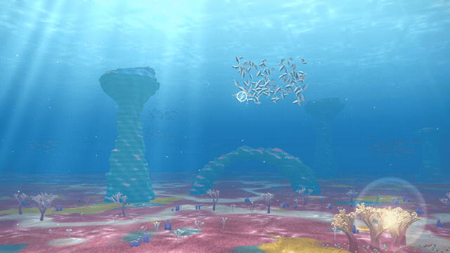

# Tiny Ocean

A small game about emergent order: guide a school of fish home to a glowing reef. You can't steer the fish. You only hold a light, and the school decides for itself what to do with it.

**Play:** https://chyanne88.github.io/tiny-ocean/

## The rules (plain language)

Every fish, every moment, looks only at the few fish close around it and follows six simple rules:

1. **Avoid**: don't bump into your neighbours. If one gets too close, move away.
2. **Follow**: swim in the same direction as the fish near you.
3. **Together**: drift toward the middle of the fish near you.
4. **Light**: if you can see the light, swim toward it.
5. **Flee**: if you see a shark, swim straight away from it, fast.
6. **Panic spreads**: if a fish near you is scared, you get scared too. Fear slowly fades.

No fish knows where home is, and no fish is the leader. The school, its shape, the way it turns all at once and the way it explodes when a shark appears all come out of these six local rules. That's the emergent part.

The shark has its own simple rules: chase the nearest fish, never enter the reef, and run away from a bright flash.

## How to play

- **Move the mouse** to move your light. Fish that can see it will swim toward it, and the rest of the school follows them.
- **Click** to flash. A shark close to the flash runs away. The flash needs a few seconds to recharge.
- Bring enough fish into the glowing reef (the small mark on the progress bar) to win the level.
- Each level adds more fish, a higher target and more sharks.

Tip: when a shark scatters the school, panic spreads from fish to fish. Wait for it to fade, then gather the small groups back together with your light.

Calm fish are silver. Scared fish flush warm, and fish that reached home take on a golden tint.

## Inspiration

- The art direction comes from *ABZÛ* (Giant Squid, 2016): a sunlit surface with caustics, god rays, pastel reef, teal rock towers fading into blue haze, and a silver school of fish.
- The schooling rules are Craig Reynolds' Boids (1986) with predator avoidance and fear contagion added.
- A classmate's "No leader" fish school project.

## Tech

One file, `index.html`, with no libraries. It uses a small hand-written WebGL2 renderer:

- One full-screen shader ray-marches the ocean: the seabed (pink grass, sand paths, moss), the rock pillars and arch (signed distance functions), the sunlit surface seen from below, animated caustics and distance fog.
- The fish, shark and coral are low-poly meshes. The fish are drawn with GPU instancing, and their tails wave in the vertex shader.
- The marine snow, coral sparkles, bubbles, the light orb and the god-ray overlay are drawn on top with additive blending.
- The fish simulation runs in plain JavaScript and uses a spatial grid so that around 200 fish stay fast.

It needs a browser with WebGL2. Any recent Chrome, Edge, Firefox or Safari works.
